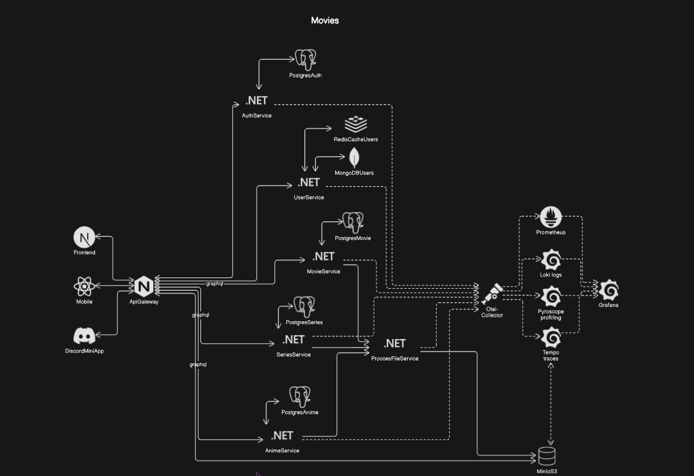

# Application Initialization

This function initializes and starts the application using Docker Compose.

- `docker compose up --build -d` is used to build and start the containers in detached mode.
- `docker compose down`: Stops and removes containers, networks, images, and volumes created by `up`.

## Architecture Diagram

Below is the architecture diagram of the application:

